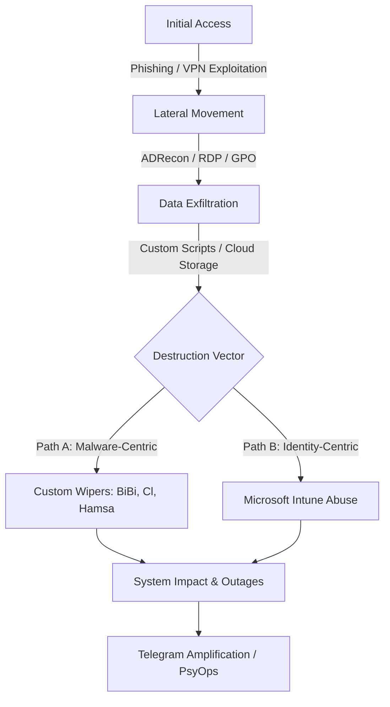

# 🚥 TLP:AMBER | CONFIDENTIAL // RISKPROFILER ASSESSMENT 3 OF 4

# THREAT ACTOR INTELLIGENCE REPORT: "HANDALA"
**Investigation ID:** RP-2026-0619-Handala  
**Target Subject:** Handala Hack Team (Void Manticore / Storm-0842)  
**Date of Report:** June 19, 2026  
**Investigating Analyst:** Threat Intelligence Team Candidate  
**Classification:** TLP:AMBER (Confidential - Named hiring panel & candidate only)

---

## 🎯 Executive Summary & Bottom Line

> [!IMPORTANT]
> **BOTTOM LINE JUDGMENT:** We assess with **HIGH CONFIDENCE** that the threat actor operating under the persona **Handala** (also known as the *Handala Hack Team*) is a state-aligned front group operated by **Iran's Ministry of Intelligence and Security (MOIS)**, specifically corresponding to the cluster tracked as **Void Manticore** (Storm-0842 / Banished Kitten). 
> 
> While Handala presents itself as an independent, pro-Palestinian hacktivist collective, their operational synchronization with Iranian geopolitical objectives, use of bespoke destructive wipers (e.g., BiBi, Cl, Hamsa), high-level coordination with other MOIS groups (e.g., Scarred Manticore), and recent shift to sophisticated, non-monetized "Living-off-the-Cloud" (LotL) remote-wipe capabilities (such as the Intune compromise at Stryker in March 2026) are highly inconsistent with grassroots hacktivism. The group’s primary objective is not financial gain or simple defacement, but rather psychological warfare, data destruction, and reputational damage to Israeli and Western interests.

---

## 1. Threat Actor Profile: Handala

### Background & Persona
Handala emerged publicly in December 2023, shortly after the October 7 escalations in the Middle East. The group adopted the name and icon of "Handala"—a famous caricature of a 10-year-old Palestinian refugee child created by cartoonist Naji al-Ali, symbolizing resistance and defiance. This persona was carefully selected to project an image of a grassroots, politically motivated digital resistance movement.

### Operational Mandate
Unlike traditional ransomware groups, Handala does not seek financial extortion. They engage in a hybrid model of **destructive cyber-attacks** and **psychological operations (PsyOps)**. Their typical playbook involves:
*   **Intrusions & Exfiltration:** Infiltrating high-value targets and stealing massive amounts of corporate, governmental, or personal data.
*   **Wiping & Sabotage:** Executing wipers or abusing administrative systems to render target servers and endpoints unusable.
*   **Doxxing & Amplification:** Broadcasting the exfiltrated data on their public Telegram channel (often with highly inflated claims of damage) to humiliate victims, induce public panic, and damage trust in Israeli infrastructure.

---

## 2. Attribution Assessment & ACH

To establish a defensible attribution call, we evaluate the threat group under three competing hypotheses using the **Analysis of Competing Hypotheses (ACH)** framework.

### Competing Hypotheses
*   **H1: Independent Grassroots Hacktivist Crew:** Handala is indeed what it claims—an independent group of ideologically motivated hackers cooperating globally to support the Palestinian cause, operating without state sponsorship.
*   **H2: Iranian State-Sponsored Front (MOIS / Void Manticore):** Handala is a state-directed cyber front operated by Iran's Ministry of Intelligence and Security (MOIS) to conduct destructive and psychological operations under the cover of hacktivism.
*   **H3: Third-Party False Flag Operation:** Handala is operated by a non-Iranian threat actor (e.g., Russia, China, or a cybercriminal syndicate) attempting to impersonate Iranian state groups or pro-Palestinian hacktivists to sow division or divert blame.

### Evidence Evaluation

1.  **E1: Advanced Enterprise Tradecraft:** The group possesses capabilities far exceeding typical hacktivists, such as compromising enterprise Global Administrators and executing automated, multi-region remote wipes via Microsoft Intune (e.g., Stryker incident, March 2026).
2.  **E2: Coordinated Group Handoffs:** Threat intelligence (Microsoft, Check Point) has documented Scarred Manticore (Storm-0861, a known MOIS-linked intrusion team) gaining initial access and exfiltrating data, then handing off the environment to Void Manticore/Handala (Storm-0842) for final destruction. Grassroots crews cannot coordinate state-level cross-group operations.
3.  **E3: Geopolitical Alignment & Timing:** Handala’s creation, target selection (Israeli critical infrastructure, police, PA systems, Western companies), and leak timing strictly align with Iranian government geopolitical reactions and statements.
4.  **E4: Custom Wiper Repositories:** Use of custom-compiled wipers (BiBi Wiper, Cl Wiper, Hamsa Wiper, No-Justice) that share code libraries, compiler configurations, and digital signatures with historical Iranian state-sponsored malware (e.g., Homeland Justice wipers targeting Albania).
5.  **E5: Infrastructure & Network Commonalities:** NetBird tunneling and C2 servers used by Handala share hosting providers, IP registration details, and SSL certificates with known Iranian Ministry of Intelligence (MOIS) infrastructure blocks (e.g., `185.190.140[.]0/24`).
6.  **E6: Persona Inflation & Information Operations:** The group’s heavy reliance on Telegram and social media to broadcast leaks, run defacements, and inflate details (e.g., claiming 200,000 devices wiped at Stryker or full compromise of Israeli police databases) matches the exact PsyOp pattern of Iranian MOIS personas (e.g., "Homeland Justice", "Moses Staff").

### ACH Matrix Table

| Evidence / Indicator | Weight | H1: Hacktivist | H2: Iranian MOIS (Favored) | H3: Third-Party False Flag |
| :--- | :---: | :---: | :---: | :---: |
| **E1:** Advanced enterprise tradecraft (Intune wipes) | **High (1.5)** | **II** | **C** | **I** |
| **E2:** Coordinated handoffs from Scarred Manticore | **High (1.5)** | **II** | **C** | **II** |
| **E3:** Strict geopolitical alignment and targeting | **Medium (1.0)** | **C** | **C** | **C** |
| **E4:** Custom wipers linked to historical Iranian malware | **High (1.5)** | **II** | **C** | **I** |
| **E5:** Shared network infrastructure with MOIS IPs | **High (1.5)** | **II** | **C** | **I** |
| **E6:** Persona inflation and Telegram PsyOps | **Medium (1.0)** | **C** | **C** | **C** |
| **Inconsistency Index (Weighted)*** | | **-9.0 (High)** | **0.0 (None)** | **-4.5 (Moderate)** |

*Legend: C = Consistent (0.0), I = Inconsistent (-1.0), II = Highly Inconsistent (-2.0), N = Neutral (0.0).*

> [!TIP]
> **Attribution Verdict:** **H2 (Iranian MOIS Front / Void Manticore)** is the only hypothesis that has zero inconsistency with the gathered evidence (Score: **0.0**). The grassroots hacktivist hypothesis (**H1**) is highly inconsistent (Score: **-9.0**), as it fails to explain the sophisticated tradecraft, MOIS network overlap, and multi-actor coordinated handoffs.

---

## 3. Operational Workflow (Attack Lifecycle)

Void Manticore (Handala) utilizes a structured, multi-phase attack lifecycle. Recently, their workflow has branched into two main vectors: **Malware-Centric Destruction** (standard path) and **Identity-Centric Cloud Destruction** (modern path).



### Detailed Lifecycle Phases

#### Phase 1: Initial Access
*   **Phishing & Credential Harvesting:** Launching targeted spearphishing campaigns. During the July 2024 CrowdStrike outage, they sent phishing emails with ZIP attachments (`update.zip`) containing wipers disguised as hotfixes.
*   **Adversary-in-the-Middle (AiTM):** Harvesting session cookies to bypass Multi-Factor Authentication (MFA).
*   **VPN Gateway Exploitation:** Brute-forcing and exploiting vulnerabilities in public-facing VPN/firewall appliances.
*   **Group Handoff:** Receiving active sessions/web shells from Scarred Manticore (Storm-0861), who perform initial network penetration.

#### Phase 2: Escalation & Lateral Movement
*   **Directory Discovery:** Using tools like **ADRecon** to map Active Directory structure and identify privileged accounts.
*   **Credential Dumping:** Extracting credentials from memory (e.g., using `comsvcs.dll` to dump LSASS).
*   **Lateral Movement:** Utilizing Remote Desktop Protocol (RDP) and Server Message Block (SMB) to move across servers.
*   **Persistence:** Configuring Group Policy Objects (GPOs) and logon scripts to ensure persistent access across domains.

#### Phase 3: Collection & Exfiltration
*   **Data Staging:** Gathering sensitive directory files, SQL databases, and email folders into temporary folders.
*   **Exfiltration:** Compressing and uploading data to external servers or cloud storage using custom scripts or legitimate tools (e.g., Rclone), prior to initiating destruction.

#### Phase 4: Destructive Impact
*   **Vector A (Malware):** Deploying custom-compiled wipers (e.g., **BiBi Wiper**, **Cl Wiper**, **Hamsa Wiper**) to overwrite partition tables, delete shadow copies, and destroy user directories.
*   **Vector B (Identity-Centric / LotL):** Misusing compromised Global Administrator credentials to log into endpoint management systems (Microsoft Intune). The group executes remote-wipe commands (Factory Reset) across thousands of enrolled laptops, workstations, and mobile devices simultaneously, rendering the physical endpoints bricked without running any local malware.

#### Phase 5: Amplification & PsyOps
*   **Telegram Seeding:** Publishing screenshots of compromised consoles, Active Directory trees, and directories on their Telegram channel (`Handala_Hack`).
*   **Data Leaks & Doxxing:** Providing links to download exfiltrated corporate data.
*   **Claim Inflation:** Exaggerating the volume of wiped systems or the criticality of the breached entity to induce fear and maximize public relations impact.

---

## 4. MITRE ATT&CK Mapping

The observed behaviors of Handala (Void Manticore) map to the following MITRE ATT&CK techniques.

| Tactics | Technique Name | ID | Specific Threat Behavior / Evidence |
| :--- | :--- | :--- | :--- |
| **Initial Access** | Spearphishing Attachment | T1566.001 | Distributed `update.zip` containing a wiper payload during the July 2024 CrowdStrike outage campaign. |
| | Exploit Public-Facing Application | T1190 | Targeted vulnerable edge VPN appliances and firewalls for entry. |
| **Execution** | Command & Scripting Interpreter | T1059 | Leveraged PowerShell and obfuscated Batch scripts to automate system discovery and launch wiper executables. |
| | User Execution | T1204 | Relied on administrators executing the fake CrowdStrike hotfix executables. |
| **Persistence** | Domain Account | T1078.002 | Compromised and maintained Global Administrator credentials in Entra ID/Azure AD. |
| | Group Policy Modification | T1484.001 | Deployed GPO logon scripts to push wipers across domain-joined systems. |
| **Defense Evasion** | Impair Defenses | T1562 | Disabled local antivirus (Microsoft Defender) and deleted system event logs before running wipers. |
| | Masquerading | T1036 | Registered typo-squatted domains (`crowdstrike[.]com[.]vc`) to masquerade as legitimate support services. |
| | Obfuscated Files/Info | T1027 | Packaged payloads using AutoIt compilers and Nullsoft (NSIS) installers to evade static scanners. |
| **Discovery** | System Information Discovery | T1082 | Malware queried target hostname, local IP, OS version, and active domain name. |
| | Domain Trust Discovery | T1482 | Used **ADRecon** script to extract complete Active Directory database and trusts. |
| **Lateral Movement** | Remote Services: RDP | T1021.001 | Utilized Remote Desktop Protocol (RDP) for internal movement between servers. |
| **C2** | Protocol Tunneling | T1572 | Employed **NetBird** client configuration to tunnel traffic and establish external C2 channels. |
| | Web Service | T1102 | Embedded Telegram bot API tokens inside wipers to exfiltrate system data and notify attackers of completion. |
| **Impact** | Data Wiped | T1485 | Deployed custom-compiled **BiBi Wiper** and **Cl Wiper** to overwrite file systems; abused Intune remote-wipe APIs. |
| | Defacement | T1491 | Defaced compromised government websites with pro-Palestinian and threatening graphics. |

---

## 5. Diamond Model Analysis

```
                    Adversary: Iranian MOIS / Void Manticore (Storm-0842)
                                   /  \
                                  /    \
                                 /      \
             Capability:         /        \          Infrastructure:
  - Custom Wipers (BiBi, Cl, Hamsa)       \  - Typo-squatted domains (e.g. crowdstrike.com.vc)
  - Intune Remote Wipe LotL Abuse         \  - NetBird Tunnel Relays
  - ADRecon & Credential Dumpers          \  - Telegram API & @Handala_Hack channel
                                 \      /
                                  \    /
                                   \  /
                     Victim: Israeli Govt, Critical Infra, Stryker Corp, Western Allies
```

### Core Features

*   **Adversary:** The threat actor Void Manticore (Storm-0842, Banished Kitten), operating as the "Handala" hacktivist persona. This is an official cyber operations unit directed by the Iranian Ministry of Intelligence and Security (MOIS).
*   **Capability:** 
    *   *Destructive Payloads:* Custom wipers written in C++ (BiBi Wiper, which appends `.BiBi` to filenames) and Go (Cl Wiper, Hamsa Wiper).
    *   *Cloud/Identity Abuse:* Ability to compromise cloud directories (Azure/Entra ID) and abuse administrative platforms (Microsoft Intune) to perform API-driven remote hardware wipes.
    *   *Reconnaissance:* ADRecon for domain mapping, LSASS dumping via `comsvcs.dll`.
*   **Infrastructure:**
    *   *Domains:* Typo-squatted domains mimicking legitimate services (e.g., `crowdstrike[.]com[.]vc` for phishing distribution).
    *   *Tunneling:* Commercial and open-source overlay networks like **NetBird** used to tunnel traffic past firewalls.
    *   *Social Channels:* Public Telegram channel `@Handala_Hack` used as the primary release mechanism for leaks and doxxing data.
*   **Victim:** Primary target vertical includes Israeli municipal systems, government networks, telecommunication providers, academic institutions, and transport infrastructure. Secondary targets include Western enterprise conglomerates (e.g., Stryker Corporation) and figures aligned with Western intelligence (e.g., FBI Director Kash Patel).

### Meta-Features
*   **Motivation:** Geopolitical sabotage, psychological warfare, and deterrence. Operations are timed to counter Israeli intelligence and military maneuvers.
*   **Tactic Hybridization:** Merging technical system destruction with media/psychological amplification.

---

## 6. Incident Analysis

We analyze two high-profile claimed incidents to evaluate Handala’s tradecraft evolution and validate their public claims.

### Incident 1: CrowdStrike Outage Phishing Wiper Campaign (July 2024)

*   **Target:** Israeli private-sector organizations and IT services.
*   **Threat Vector:** Social engineering and phishing. Exploiting the July 19, 2024, CrowdStrike Falcon sensor crash, the group sent phishing emails claiming to distribute a "CrowdStrike Hotfix" to repair system boot loops.
*   **Technical Payload:** 
    *   Phishing emails redirected users to download a ZIP file named `update.zip` hosted on the typo-squatted domain `crowdstrike[.]com[.]vc`.
    *   `update.zip` contained an obfuscated Nullsoft Scriptable Install System (NSIS) executable.
    *   Upon execution, it launched a custom Wiper payload that scanned system drives for user documents, databases, and configuration files, overwriting them with random byte blocks. It dropped a DLL named `OpenFileFinder.dll` to find and target specific files.
    *   The wiper made outbound HTTP POST connections to the Telegram Bot API to notify the threat actor of successful infection (exfiltrating hostname, IP, and target execution duration).
*   **Validation & Impact:** Independent security firms Splunk, Cisco Talos, and Trellix analyzed the campaign and confirmed successful infections across multiple Israeli entities. The impact was mitigated because organizations were already on high alert due to the CrowdStrike incident, though several private firms suffered localized data loss.

### Incident 2: Stryker Corporation Microsoft Intune Abuse (March 2026)

*   **Target:** Stryker Corporation (U.S. Medical Technology Multination).
*   **Threat Vector:** Identity Compromise & Living-off-the-Cloud (LotL).
*   **Technical Payload:** 
    *   No custom wiper malware was deployed. The group bypassed traditional endpoint security (EDR/AV) by compromising Global Administrator accounts in the victim’s Entra ID/Azure AD tenant.
    *   The threat actors logged into the **Microsoft Intune** administration console.
    *   They abused the native, legitimate **"Remote Wipe" (Factory Reset)** function, issuing API commands to wipe enrolled endpoints.
*   **Validation & Impact:** Handala declared "Operation Epic Fury" on Telegram, claiming they successfully wiped over 200,000 corporate devices across 79 countries. 
    *   *Validation Check:* Palo Alto Networks and Fortiguard corroborated that Stryker suffered an identity-compromise event leading to remote wipes. However, forensic analysis indicated Handala's claims of "200,000 devices wiped" were highly inflated. The actual impact was limited to several thousand devices, primarily laptops and mobile endpoints. Core clinical servers and medical manufacturing networks remained isolated, preventing the catastrophic disruption claimed by the actor. This illustrates Handala's classic strategy of **claim inflation** to maximize psychological impact.

### Indicators of Compromise (IOC) Database

All indicators are defanged and must not be accessed.

| Type | Value (Defanged) | Context / Associated Campaign |
| :--- | :--- | :--- |
| **Domain** | `crowdstrike[.]com[.]vc` | Phishing distribution site (July 2024 CrowdStrike campaign) |
| **File Hash (SHA-256)** | `96dec6e07229201a02f538310815c695cf6147c548ff1c6a0def2fe38f3dcbc8` | Malicious `update.zip` (Fake CrowdStrike Hotfix) |
| **File Hash (SHA-256)** | `8316065c4536384611cbe7b6ba6a5f12f10db09949e66cb608c92ae8b69e4d67` | `OpenFileFinder.dll` file search utility |
| **File Hash (SHA-256)** | `19001dd441e50233d7f0addb4fcd405a70ac3d5e310ff20b331d6f1a29c634f0` | Phishing notification PDF (CrowdStrike Outage Hook) |
| **IP Address** | `185[.]190[.]140[.]182` | Historical NetBird tunnel exit and C2 configuration node |
| **IP Address** | `185[.]190[.]140[.]240` | Staging domain host IP linked to Handala C2 callbacks |
| **Telegram Channel** | `@Handala_Hack` | Threat actor communication and data disclosure channel |

---

## 7. Confidence, Gaps & Limitations

### Analyst Confidence Calibration
*   **Attribution to Iranian MOIS (Void Manticore):** **HIGH CONFIDENCE**. Corroborated by multiple independent, highly reputable intelligence firms (Microsoft, Check Point, Palo Alto Networks, SentinelOne) utilizing code overlaps, infrastructure commonalities, and documented handoffs from Scarred Manticore (Storm-0861).
*   **Stryker Corporation Intune Abuse Scope:** **MODERATE CONFIDENCE**. While the attack mechanism (Intune remote wipe abuse) is verified, the exact number of wiped devices remains single-source (actor-claim-only) and is assessed to be highly exaggerated.
*   **Kindergarten PA System Incident Scope:** **LOW-TO-MODERATE CONFIDENCE**. The group published video recordings of PA systems playing music, but independent verification of how many networks were affected remains minimal.

### Technical Gaps
*   **Initial Compromise Vector for Stryker:** The exact method used to acquire Stryker's Global Administrator credentials (e.g., phishing, session hijacking via token theft, or secondary access purchased from an Initial Access Broker) remains unconfirmed due to public disclosure limitations.
*   **Scarred Manticore Collaboration Structure:** The organizational structure governing the handoff between Scarred Manticore (intrusion team) and Void Manticore/Handala (destruction team) is unknown. It is unclear if they are separate divisions within the MOIS or the same operational team utilizing different personas.

---

## 🛡️ Rules of Engagement Compliance Statement

This threat intelligence assessment was conducted under strict compliance with the **Rules of Engagement**:
1.  **Passive OSINT Only:** All information was gathered from publicly available, verified threat intelligence reports and metadata analysis of public social media channels.
2.  **No Interaction with Threat Actors:** No communication, transaction, or registration was performed with the Handala Telegram channel, bot, or other threat actor assets.
3.  **No Victim Data Downloaded:** No leaked or stolen databases published by Handala were accessed, downloaded, or distributed.
4.  **No Malware Stored/Executed:** No active wiper binaries or exploit codes were downloaded or run. All analyzed hashes and IOCs are defanged for tracking and defense-in-depth planning.
5.  **Clean isolated VM Environment:** All OSINT queries and searches were conducted using dedicated research VMs configured with VPN infrastructure and non-attributable personas.

---
`TLP:AMBER // RISKPROFILER PRE-HIRE PRACTICAL ASSESSMENT // CONFIDENTIAL // PAGE 1 OF 6`
